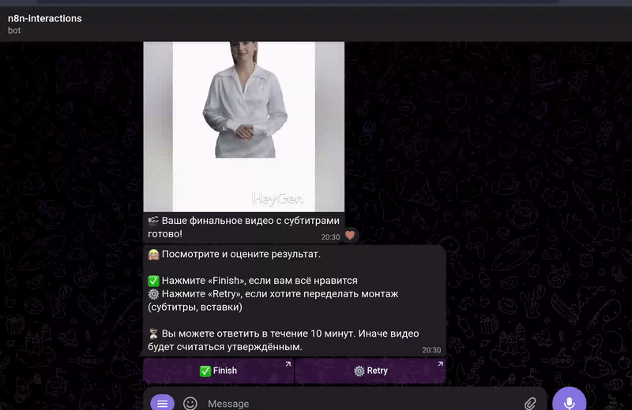
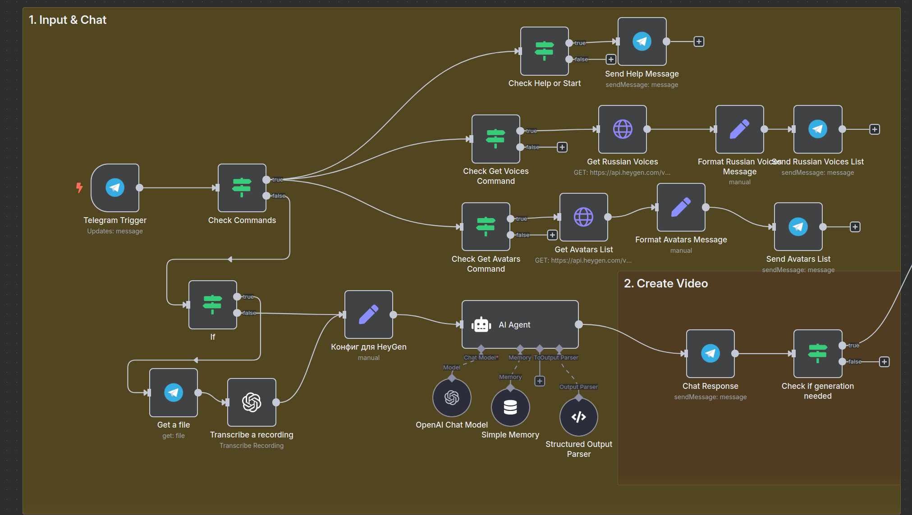
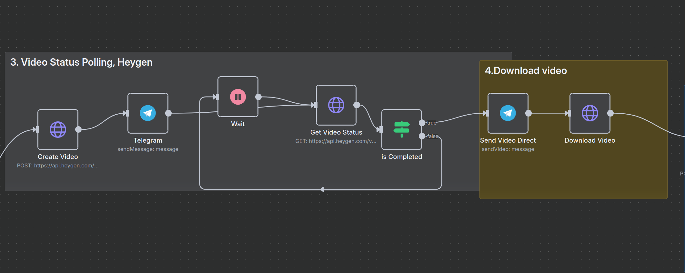
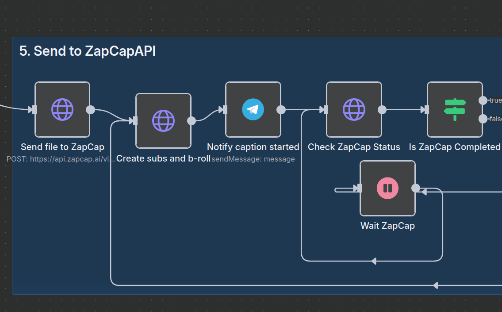
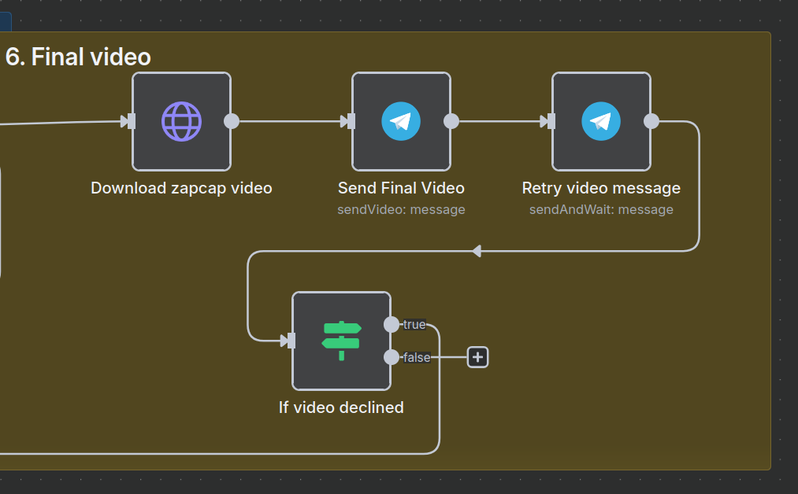

## **AI Avatar Video Generator**

Advanced automation pipeline that transforms **text messages or voice recordings** into professional video content using AI avatars, voice synthesis, and automated post-processing.

**Tech Stack:** n8n, HeyGen API, OpenAI GPT-4.1, ZapCap API, Telegram Bot API

### Key Features:
- **Dual input modes** - Text messages and voice message transcription via OpenAI Whisper
- **Intelligent content processing** - GPT-4 powered script optimization for social media formats
- **AI avatar generation** - HeyGen integration for realistic video synthesis with Russian voice support
- **Automated post-production** - ZapCap integration for animated subtitles, B-roll, and effects
- **Production workflow** - Complete pipeline from input to final video delivery

### Technical Implementation:
#### Step 1: Input Processing & AI Chat

- **Multi-command Telegram bot** with webhook triggers and conditional routing
- **Voice processing pipeline** - Telegram file API → OpenAI Whisper transcription
- **Intelligent conversation flow** - Memory-enabled AI agent with structured JSON output parsing
- **Decision-making logic** - Conditional checks for video generation approval

#### Step 2: Video Generation & Polling

- **HeyGen API integration** - POST request for video creation with avatar and voice parameters
- **Video processing** - Wait mechanism with periodic status polling
- **Status monitoring** - GET requests to track video generation progress
- **Conditional delivery** - Completion checks before file download and Telegram delivery

#### Step 3: Post-Production with ZapCap

- **File upload to ZapCap API** - Multipart form data transmission of generated video
- **Automated subtitle generation** - AI-powered transcription with animated text effects
- **B-roll integration** - Contextual video clips and visual enhancements
- **Status polling loop** - Periodic checks with wait mechanisms until processing complete

#### Step 4: Final Delivery & User Feedback

- **Enhanced video download** - Retrieval of post-processed video with subtitles and effects
- **Telegram delivery** - Binary file transmission to user via sendVideo operation
- **Interactive approval system** - User feedback collection with retry/approve options
- **Conditional re-processing** - Loop-back mechanism for video regeneration if declined

**Pipeline:** Text/Voice Input → Transcription (if voice) → AI Script Generation → Video Synthesis → Post-Production → Delivery

Built as a production-ready automation demonstrating integration of multiple AI services into a cohesive workflow supporting both text and voice inputs.