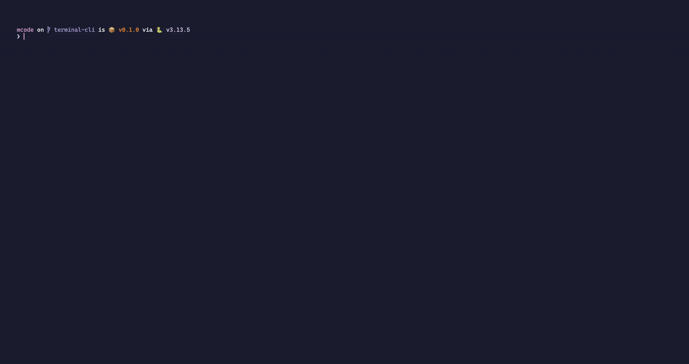
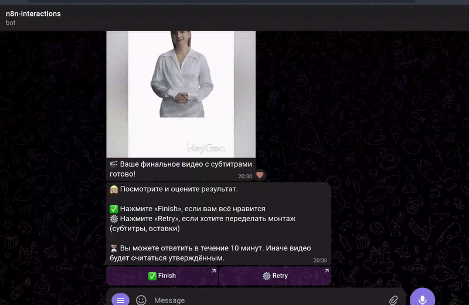



  

    <h6>🛡️ Security RAG</h6>
    
AI safety guardrail system

    
    
<medium>Enhanced LLM safety through retrieval-augmented generation. Achieved 89.9% F1-weighted score in response harm detection with Ollama, Chroma, and Docker support.</medium>

    
<a href="security_rag" class="btn btn--primary btn--medium">View Project</a>

  

  
  

    <h6>💻 mcode</h6>
    
AI-coding CLI

    
    
<medium>Multi-provider AI coding assistant supporting OpenAI, Gemini, Ollama, OpenRouter with persistent chat history and upcoming MCP support.</medium>

    
<a href="mcode" class="btn btn--primary btn--medium">View Project</a>

  

  
  

    <h6>🎬 ZapCap MCP Server</h6>
    
Unofficial MCP server for video captioning with Claude

    
    
<medium>Streamlines video captioning and b-roll creation using natural language. Customizable templates, emojis, word count, and b-roll percentage settings.</medium>

    
<a href="zap_cap_mcp" class="btn btn--primary btn--medium">View Project</a>

  

  
  

    <h6>🤖 AI Avatar Video Generator</h6>
    
AI avatar automation and post-processing using n8n

    
    
<medium>Transforms text messages or voice recordings into professional AI avatar videos with automated post-production workflows.</medium>

    
<a href="ai_avatar_gen" class="btn btn--primary btn--medium">View Project</a>

  


{{ projects-grid }}